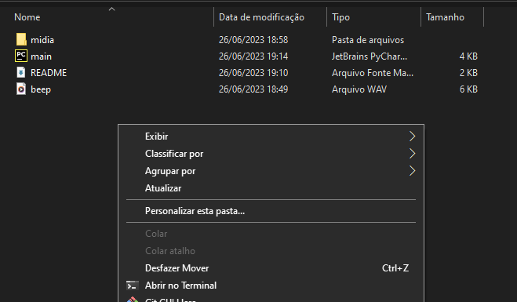
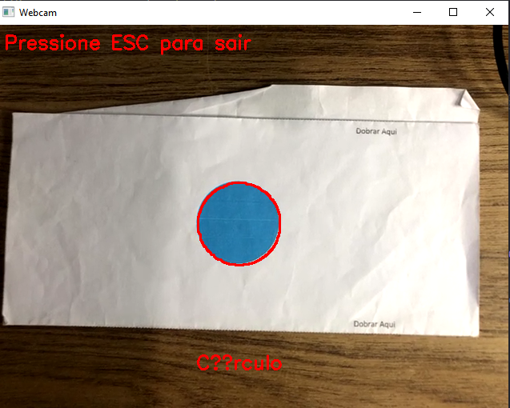
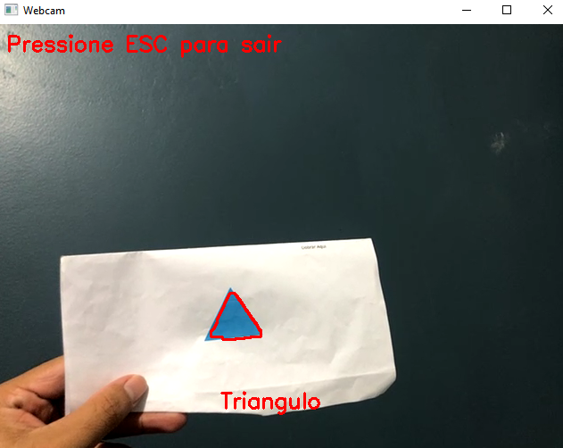

## 1 - Projeto funcionando


## 2 - Do que se trata
Este projeto, trata-se de uma aplicação que através da webcam conectada em seu computador (seja ela webcam interna ou externa), possibilite em tempo real, a identificação das formas geométricas, retângulo, círculo e triângulo.
E além disso, seja visivel na parte inferior da tela o nome da forma, e avise o usuário com um sinal sonoro, quando a forma for reconhecida.

## 3 - Tecnologia utilizadas
* Python 3.10.0
* Opencv-python (Version: 4.7.0.72)
* Numpy (Version: 1.24.3)
* pygame (Version: 2.5.0)

## 4 - Como rodar o projeto na máquina
* Para rodar o projeto na sua máquina, baixe a pasta deste repositório, onde contém os arquivos  `main.py` e `beep.wav`, e em seguida instale as bibliotecas citadas acima.
* Para instalar basta abrir o terminal do seu computador (Pode ser acessado pelo atalho `windows + r` e na janela que aparecer digite `cmd` e clique `ENTER`)
* Com o terminal aberto digite os comandos abaixo:

    ```~pyhton
    pip install opencv-phyton
    pip instal numpy
    pip install pygame
    ```
Com o ambiente e as bilbiotecas instaladas, para abrir o programa, na pasta do projeto clique no botão direito do mouse e selecione a opção `Abrir no Terminal`


Em seguida, com o terminal aberto, escreve o seguinte código
        
    python main.py
    
Feito isto, a câmera será habilitada e pronta para executar o teste com as formas

**OBS**: PARA MELHORES RESULTADOS ESCOLHA UM LUGAR COM BOA ILUMINAÇÃO SEM MUITOS RUÍDOS (INFORMAÇÕES), COMO POR EXEMPLO UMA MESA OU UMA PAREDE DE COR ÚNICA, E APROXIME AS IMAGENS DE MODO QUE OCUPE O MAIOR ESPAÇO DENTRO DO VÍDEO.






## 5 - Referências
[Acervo Lima - MÉTODO CV2.PUTTEXT())](https://acervolima.com/python-opencv-metodo-cv2-puttext/)

[Acervo Lima - DETECTAR FORMAS EM IMAGENS)](https://acervolima.com/python-opencv-metodo-cv2-puttext/)

[Youtube - Ball Detection Using OpenCV in Python)](https://youtu.be/RaCwLrKuS1w)

[Youtube - 4. Detección de polígonos y calculo de distancia de un objeto con Open Cv y python SIRAP)](https://youtu.be/fu0pLTOpgxE)

[Youtube - Reconhecimento e Contagem de Moedas com Visão Computacional | Opencv Python | Tensorflow)](https://youtu.be/qgTerD7-CeM)

[Youtube - Como Controlar WebCam com Python [Introdução ao OpenCV])](https://youtu.be/r8Qg3NfdiHc)

